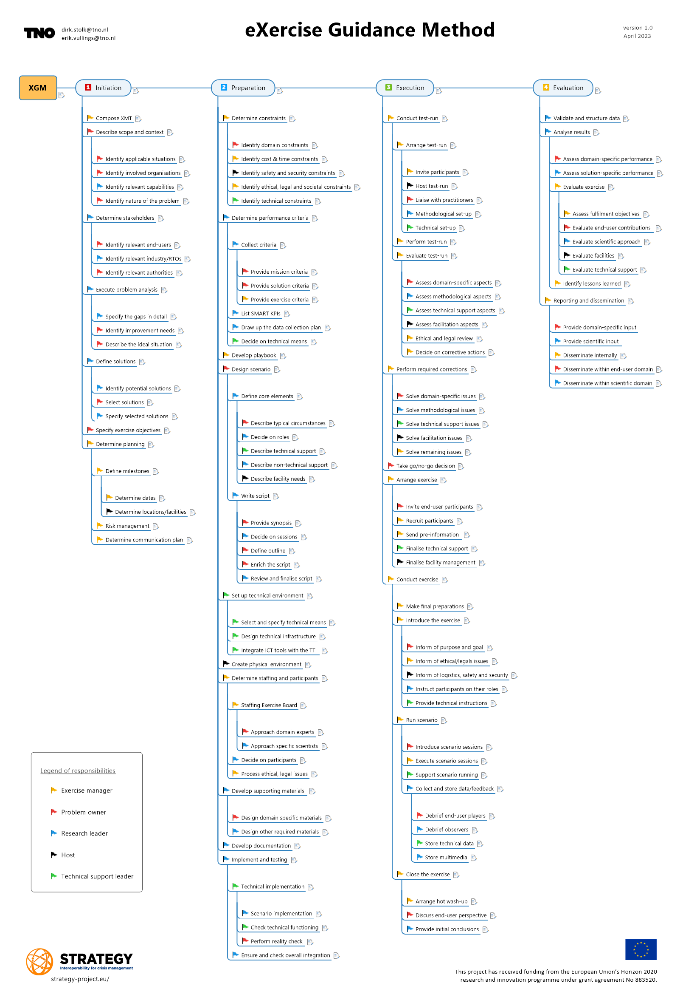

# Exercise Guidance Method (XGM)

The Exercise Guidance Method is developed to support Crisis Management professionals in setting up live or tabletop exercises. It divides the whole process into four phases, i.e. initiation, preparation, execution and evaluation, each with specific tasks and assigned to specific roles. Naturally, not all exercises will need to fulfil all of these steps, but it should prevent you from missing important aspects. Besides the image shown below, there is also an [interactive eXercise Guidance Method mindmap](https://strategy-eu.github.io/XGM). You can also download the A3 PDF version [here](docs/XGM_TNO.pdf).

More detailed information about the [specific roles of the Exercise Management Team](https://strategy-eu.github.io/XGM/exercise_management_team_v1.0.html), which can also be downloaded as PDF from [here](docs/XMT_TNO.pdf).

